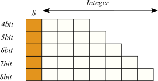
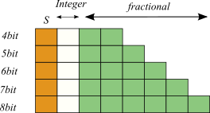
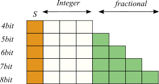
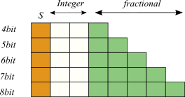
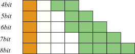
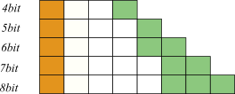

# Activation Functions Library.

Contains hardware-efficient implementations of Activation functions that can be used in NN, CNN applications.

The activation functions Binary step (Bstep), Sigmoid, Gaussian, tanh, Rectified Linear Unit (ReLU), Gaussian Error Linear Unit (GeLU), Softplus are implemented. All the functions contain circuits quantised from 4bit to 8bit word length.

Four different fixed point configuration are provided with different range-precision tradoffs : 
Configuration 1 for all functions :

Configuration 2 for Gaussian :

Configuration 2 for Sigmoid :

Configuration 2 for tanh :

Configuration 3 for all functions :

Configuration 4 for all functions :

The folders contain error characteristics reports and hardware reports for all the circuits. A error plot is also provided to visualize the circuit output, location of erroneous output and the histogram of error values.

The Circuit Photos of all the activation functions are included to understand the structure of combinatorial circuits.

